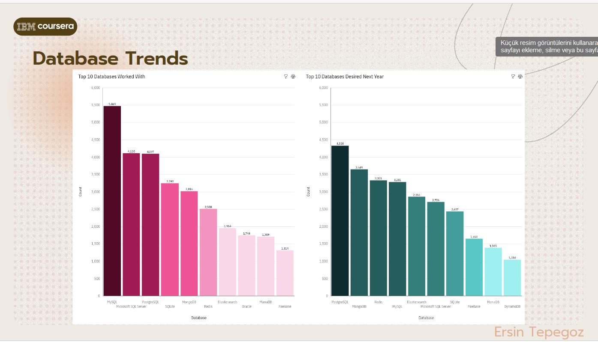

# DataAnalyticsProject – Emerging Tech Trends in Software

This project analyzes trends in programming languages, databases, and developer preferences using data from multiple sources, including the 2019 Stack Overflow Developer Survey and GitHub job postings. The goal is to uncover which technologies are most used, most desired, and why certain trends are emerging in the software world.

Although the code was written and visualized using online platforms and is not included here, this repository documents the full analysis process through summaries, visuals, and a presentation.

## 🔍 Project Goals
- Explore trends in programming languages and databases
- Understand developer preferences and job market needs
- Create meaningful visualizations and dashboards
- Derive insights for companies and aspiring developers

## 📊 Tools & Data Sources
- Stack Overflow Developer Survey (2019)
- GitHub Jobs API (modified)
- Web scraping for salary data
- Google Looker Studio (dashboard creation)

## 📈 Key Insights
- **JavaScript** is the most used and desired language
- **Python** shows strong growth in both demand and salary
- **TypeScript**, **Kotlin**, and **Go** are gaining attention for their simplicity and typing features
- Developers prefer technologies that are simple, declarative, and less error-prone
- NoSQL databases like **MongoDB** and services like **Firebase** are rising in popularity
- **PostgreSQL** stands out for usability and rich features

## 🖼️ Visuals
You can find screenshots of dashboards and key charts in the `/images` folder.  
Example:  

# Presentation

The Data Analyst presentation PDF is available here:  
[Download PDF](https://drive.google.com/file/d/1cS2LjYCriSyBPk34LyKpBbdVBCWpZjiT/view?usp=drive_link)

## 👤 Author
**Ersin Tepegoz**  
📫 [tepegozersin@gmail.com](mailto:tepegozersin@gmail.com)
